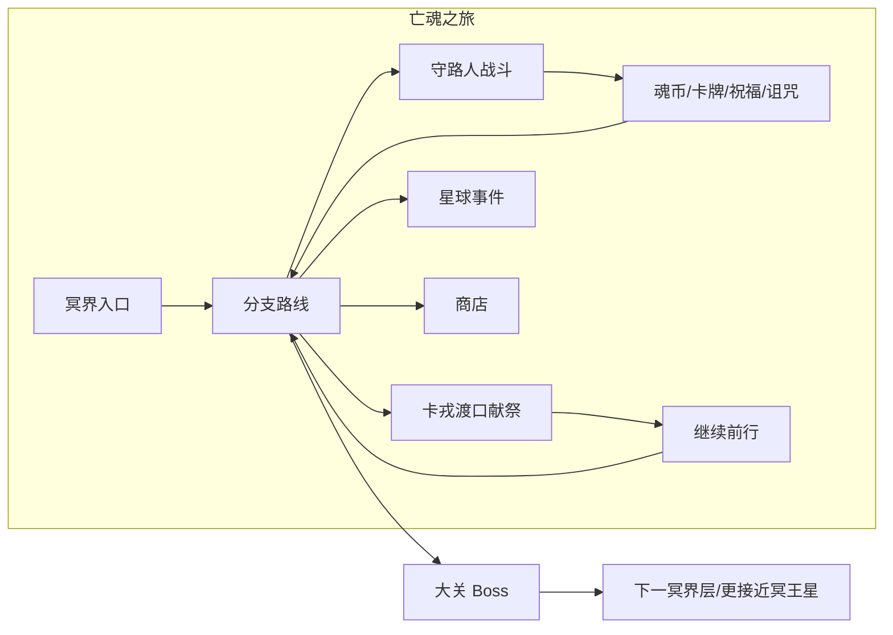
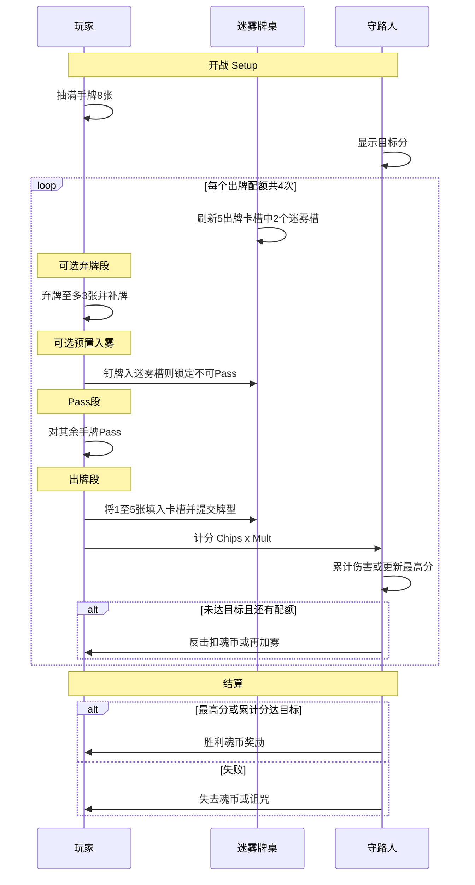
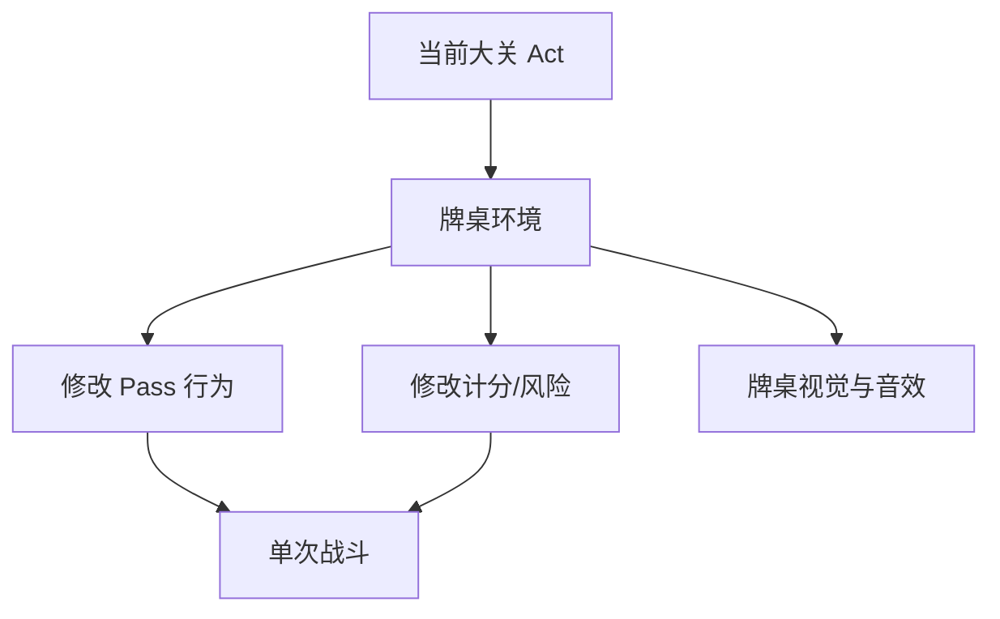
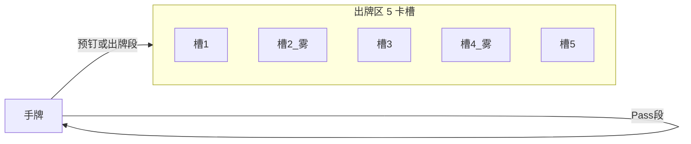
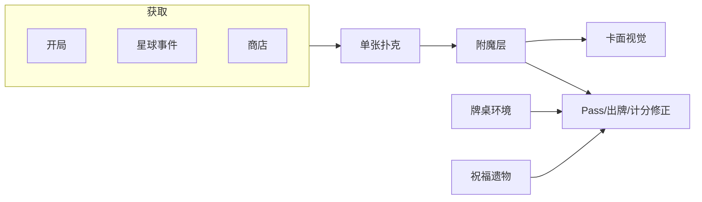
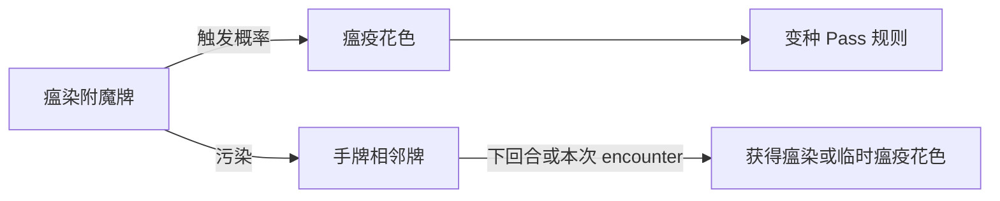
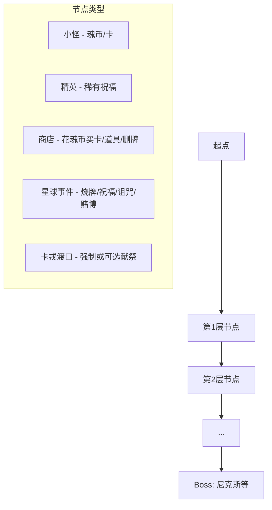
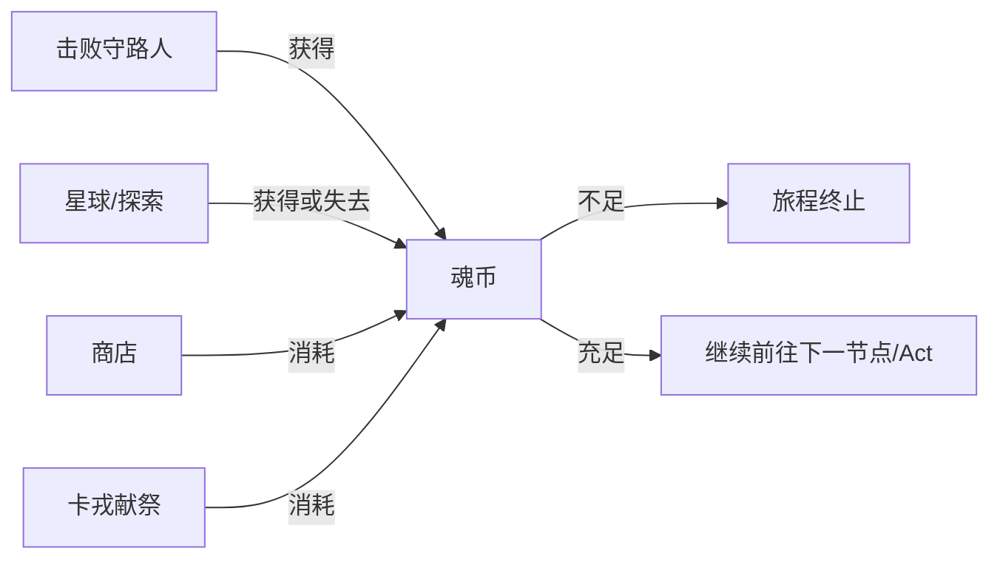

# PasserCard — 主题与玩法设计讨论稿

## 我知道的小丑牌 vs 你们的 PasserCard


| 维度   | 小丑牌 (Balatro)       | PasserCard（你的描述）                         |
| ---- | ------------------- | ---------------------------------------- |
| 题材   | 赌场/抽象               | 希腊冥界 → 冥王星，亡魂 Passer                     |
| 核心资源 | 回合内 Chips × Mult    | **魂币**（无血量，既是续命也是商店货币）                   |
| 地图   | 相对线性盲注              | **多分支路线**（商店/星球事件/精英/小怪）                 |
| 牌    | 标准扑克 + 大量 Joker 改规则 | 标准扑克 + **Pass 翻转** + **附魔（四骑士）** + 祝福/诅咒 |
| 战场   | 盲注类型（Small/Big/Boss） | **牌桌环境**（随 Act 变化，改 Pass/出牌规则）           |
| 压力来源 | 每盲注目标分              | **卡戎献祭** + 守路人战斗                         |
| 结构   | 8 盲注 + Boss 盲注      | **多 Act + Act Boss**（尼克斯、许德拉、刻耳柏洛斯、斯提克斯） |


结论：PasserCard 不是 Balatro 换皮，而是 **STS 式路线 Roguelike × 扑克牌型战斗 × 双面 Pass 机制 × 魂币经济 × 牌桌环境 × 附魔（四骑士）** 的组合。防单调的三层变化来源：**大关牌桌**、**单牌附魔**、**Run 构筑（套牌/身份）**。

---

## 主题与叙事框架




**玩家身份**：Passer（亡魂），目标不是「赢牌」，而是 **带着足够的魂币穿过冥界、抵达冥王星**。

**魂币的双重用途（核心张力）**：

- **献祭给卡戎** — 不交则无法继续旅程（游戏结束条件之一）
- **购买与强化** — 商店卡牌、道具、移除诅咒、星球事件选项

**敌人层级**：

- 普通：幽灵、亡魂等冥界路人
- 精英：更强守路人（待设计）
- Boss（大关关底）：尼克斯、许德拉、刻耳柏洛斯（科波若斯）、斯提克斯 — 每人应有 **机制型规则**（例如 Styx 与 Pass/翻转相关，Cerberus 与三道门/三次献祭相关等）

---

## 局内核心：Pass（翻转）+ 扑克牌型

### 牌面模型（与现有代码差异最大）

当前 `[CardDefinition.cs](Assets/_Project/Scripts/Cards/CardDefinition.cs)` 是 TCG 模型（cost/attack/health），**需要整体替换**为扑克 + 双面模型：

```csharp
// 概念模型（非最终实现）
PlayingCard {
    Suit suit;           // 黑桃/红心/梅花/方块
    Rank cornerA;        // 左上角点数（如 7）
    Rank cornerB;        // 右下角点数（如 K）
    bool isFlipped;      // 当前哪一面「生效」
}
```

**Pass 操作**：玩家在出牌阶段对选中牌执行翻转，使 **生效点数** 在 cornerA / cornerB 间切换，以组成更优扑克牌型。

### 四原花色 Pass 规则（建议定稿）

**原则**：Pass 一律 **切换 cornerA/cornerB 生效面**；花色只决定 **Pass 时/Pass 后的附加效果**。让玩家在「凑牌型」之外还要算 **魂币、Pass 次数、顺子/同花资格**。

| 花色 | 冥界主题 | Pass 附加效果 | 设计意图 |
|------|----------|---------------|----------|
| **♠ 黑桃** | 冥河 / 斯提克斯 | Pass 后 **生效点数 +1**（封顶 A），但该牌 **不计入顺子**（仍可参与对子、同花、高牌） | 拿大牌型牺牲顺子；和「折角锁定」形成对照 |
| **♥ 红心** | 魂 / 献祭 | Pass 后 **获得 1 魂币**；若本局已因红心 Pass 获得过魂币，则 **本次牌型 Chips −10%**（可叠层上限 3） | 穷途卖血换路费；和卡戎经济直接挂钩 |
| **♣ 梅花** | 旅途 / 迷途 | Pass **不消耗 Pass 次数**；Pass 后标记 **「迷途」**：下一张你 Pass 的牌 **必须 Pass 两次**（切到另一面再切回，或强制再 Pass 一次才生效） | 免费 Pass 的诱饵，可能浪费操作 |
| **♦ 方块** | 魂币 / 交易 | Pass **消耗 1 魂币**；生效面切换且 **本牌 Chips +15**（或 +Rank 视作 +1 仅计分不改 corner） | 花钱买分；富裕时强化牌型 |

**瘟疫变种（对应四原色，弱化版）**：

| 原花色 | 瘟疫名 | Pass 效果（相对原规则） |
|--------|--------|-------------------------|
| ♠ | 腐泉 | +1 但 **也不计同花** |
| ♥ | 脓血 | 得 1 魂币但 **同时失去 1 魂币**（50% 净零） |
| ♣ | 枯疫 | 仍不占 Pass 次数，但 **迷途必触发**（无法豁免） |
| ♦ | 锈疫 | 耗 1 魂币但 **Chips 加成减半** |

**交互备注**：
- **迷雾牌桌（卡槽）**：放入 **迷雾出牌卡槽** 的牌 **本配额不可 Pass**（见 Act 1 定稿）；♣ 免费 Pass、花色增益均不适用
- **折角（饥荒）**：锁定面后 **花色 Pass 效果不再触发**（稳定 vs 增益的取舍）
- **枯寂（死亡）**：仅 **焚灭爆发**，见下

### 单次 Encounter 流程（建议定稿 · 小丑牌启发）

**参考对照**：

| 游戏 | 单次战斗节奏 | PasserCard 借鉴点 |
|------|--------------|-------------------|
| **小丑牌** | 有限 **出牌次数** + **弃牌次数**；每出 1～5 张计 poker 分；Chips×Mult 叠层 | **出牌/弃牌配额**、单次 1～5 张、牌型计分 |
| **杀戮尖塔** | 多回合、每回合能量打牌 | **守路人反击阶段**（扣魂币/加雾） |
| **Inscryption** | 棋盘 + 献祭 | **枯寂烧牌** 的永久后果感 |

**推荐流程：「盲注式三幕 + Pass 段」**（单局 encounter 2～4 分钟）



**数值骨架（Act 1 可调）**：

| 参数 | 建议值 | 说明 |
|------|--------|------|
| 手牌上限 | 8 | 大于 5，留出 Pass/弃牌空间 |
| **出牌次数** | **4** | 类似 Balatro「Hands」 |
| **弃牌次数** | **3** | 类似 Balatro「Discards」，弃后补牌 |
| **Pass 次数** | **5 / encounter** | 全局池；♣ 梅花 Pass 不占次数 |
| 单次出牌张数 | 1～5 | 不足 5 张按实际张数算牌型（同 Balatro） |
| 胜负判定 | **单次最高分 ≥ 目标分** | 简单直观；精英可改 **累计分** |
| 守路人反击 | 每用完 1 次出牌配额未达标 → **−2 魂币** 或 **下配额多 1 迷雾槽**（2→3） | 拖回合有代价 |

**为何比「一战一锤」有趣**：
- **弃牌 + Pass + 出牌** 三阶段，每配额一次小 puzzle，而不是只赌一手
- **最高分制** 允许前几次「探路」，最后一次 all-in；枯寂牌适合放在最后一手
- **配额用尽后的反击** 惩罚拖战，和魂币主题一致
- Act 1 **迷雾在出牌卡槽**：每配额刷新 2/5 槽为雾；可 **预钉入雾** 锁面，或 Pass 后避开雾槽 — 与 Pass 形成空间博弈

**与小丑牌刻意差异**（避免纯克隆）：
- 无 Joker 槽，改 **附魔在牌上** + **牌桌环境**
- 无 Chips/Mult 乘区叠 Joker，改 **牌型基础分 × 简单倍率（祝福/附魔/枯寂）**
- **Pass 与双面角点** 是核心操作，Balatro 无对应物

### 战斗计分（德扑牌型）

沿用标准牌型优先级（高牌 → 一对 → … → 皇家同花顺）。计分公式建议：

**最终得分 = 牌型基础 Chips × 牌型倍率 Mult ×（祝福/牌桌修正）+ 单牌 Chips 加算（♦ 等）**

- 牌型基础分表可抄 Balatro 量级（高牌 5、对子 10、…、同花顺 100）再按 Act 缩放目标分
- **枯寂焚灭**：该牌打出后移出 Run 牌库，且 **Mult ×2（仅该次出牌）**

Encounter 内流程见上节 **「盲注式三幕 + Pass 段」**；不再使用「一战一锤」或 Hold'em 2+5 结构（Phase 1 采用 **1～5 张标准牌型**）。

**与现有 `[Deck.cs](Assets/_Project/Scripts/Gameplay/Deck.cs)` / `[Hand.cs](Assets/_Project/Scripts/Gameplay/Hand.cs)`**：可保留「抽牌/手牌区」抽象，但牌类型与 `CardInstance` 需重写。

---

## 牌桌环境（Table Environment）

**定位**：与当前 **Act（大关）** 绑定的 encounter 级规则层，改变 Pass、出牌、风险结构，避免「每战只是换目标分」的单调感。

**生效范围**：进入该 Act 后，本 Act 内所有战斗（含精英，Boss 可叠加专属机制）默认继承当前牌桌；部分星球事件可临时切换或免疫牌桌效果。



### 牌桌示例（草案，可扩展）

| Act | 牌桌 | 主题联想 | 规则 |
|-----|------|----------|------|
| **Act 1** ✅ | **迷雾牌桌** | 尼克斯之暗 | **出牌区 5 卡槽**，每配额刷新 **2 个迷雾槽**；入雾牌 **本配额不可 Pass** |
| Act 2+ | **光滑牌桌** | 冥河冰面 | Pass 时 **有概率额外翻转一次**（不可控） |
| Act 2+ | **荆棘牌桌** | 惩罚之途 | Pass **消耗魂币**；未 Pass 的牌出牌后 **扣少量魂币** |
| Act 2+ | **裂隙牌桌** | 深层冥界 | 与 **裂痕附魔** 联动：分裂触发概率提升 |

**Act 1 · 迷雾牌桌（已定稿 · 卡槽制）**



- **每配额开始**：5 个出牌卡槽中 **随机 2 个** 变为迷雾槽（视觉：灰雾罩槽 + 槽位高亮）；精英 **2→3** 雾槽，Boss 尼克斯 **3 雾槽**
- **阶段顺序**（每配额）：弃牌 → **（可选）预钉入雾** → Pass → 填槽出牌 → 计分
- **预钉入雾**：Pass 前将牌拖入迷雾槽 → **锁定当前生效面，本配额不可 Pass**（适合已选好面的牌）
- **Pass 后再填槽**：Pass 阶段仅对 **未钉雾且仍在手牌** 的牌操作；最终 1～5 张占槽提交；**占迷雾槽的牌不得在本配额 Pass 过**（若 Pass 过则不可放入雾槽，或放入时 **撤销 Pass 效果** — 实现取前者更简单）
- **迷雾槽内牌**：**不触发花色 Pass 增益/副作用**（♥ 不得币、♦ 不扣费等），仅计当前 locked 面
- **Boss 尼克斯**：迷雾槽内牌 **提交前 UI 隐藏非生效角**（或两角皆模糊直到确认），强化信息压力
- **UI 布局**：手牌区在下 / 出牌 5 槽在上（Balatro 式 play area）；牌桌环境名与「本配额雾槽」指示器常驻

**设计原则**：
- 牌桌改 **规则**，不直接改牌库内容（与附魔、祝福分工明确）
- 每个 Act 1 个主牌桌 + Boss 战可选 **强化版牌桌** 或 Boss 专属 override
- UI 需明显展示当前牌桌名称与一条规则摘要

---

## 附魔（Enchantment）— 天启四骑士

**定位**：施加在 **单张扑克牌** 上的持久修饰（类似「牌面上的诅咒/祝福」），与全局 **祝福（遗物）** 区分：遗物跟 Run 走，附魔跟牌走。

**获取途径**：
- 开局选择 / 初始套牌自带
- **星球事件**（随机赋予或强制选择附魔）
- **商店**购买「附魔服务」或已附魔的特殊牌

**叙事包装**：四骑士作为冥界旅途中的 **天启异象**（与希腊 Boss 并存：Boss 是「守路人」，骑士是「牌面灾变」），在 UI 上用骑士纹章区分。



### 四骑士附魔（已定稿方向）

| 骑士 | 附魔名 | 卡面表现 | 效果 |
|------|--------|----------|------|
| **战争** | **裂痕** | 斜对角裂痕 | 特定条件下 **分裂为两张半张**；牌库永久 +1 实体；与牌型判定、裂隙牌桌联动 |
| **饥荒** | **折角** | 一角折起 | **稳定加点** 或 **锁定生效面**（Pass 无效）；counter 光滑/迷雾下的翻转不确定性 |
| **瘟疫** ✅ | **瘟染** | 斑点/异色花色 | 见下节 **瘟疫花色** |
| **死亡** ✅ | **枯寂** | 灰化/骷髅角标 | 见下节 **死亡双模式** |

#### 瘟疫·瘟染 — 瘟疫花色（已定稿）

**核心**：不是单纯 debuff，而是把牌 **概率转化为「瘟疫花色」** — 原有 ♠♥♣♦ 的 **变种**，保留原花色 Pass 逻辑的「扭曲版」，并 **向相邻牌传播**。



**规则草案**：
- **触发时机**：打出、Pass 后、或 encounter 开始时掷概率（可配置）
- **瘟疫花色**：例如 ♠→「腐泉」、♥→「脓血」、♣→「枯疫」、♦→「锈疫」— 各对应 **弱化版 Pass 效果 + 计分惩罚/特殊 chips**
- **污染相邻牌**：手牌 **左右各 1 张**（仅线性手牌条，Phase 1 不做多行）；获得 **临时瘟疫花色** 或 **瘟染层 +1**
- **净化**：商店/星球「净河」事件可移除瘟染；祝福可免疫传播

**与四原花色的关系**：实现上 `Suit` 枚举扩展为 `BaseSuit + PlagueVariant`，Pass 规则表用 **8 行**（或 Modifier 覆盖）而非硬编码。

#### 死亡·枯寂 — 焚灭爆发（已定稿）

- 打出后 **永久移出 Run 牌库**
- 该次出牌 **整手 Mult ×2**（ sacrifice 一张换一手爆发）
- 不做魂化换币；魂币压力由 ♥/♦/卡戎承担
- UI：最后一次 **出牌配额** 时枯寂牌高亮

### 规则交互优先级（建议）

1. **牌桌环境**（ encounter 级底层）
2. **附魔**（单牌级）
3. **花色 Pass 规则**
4. **祝福 / 诅咒**（Run 级被动）
5. **Pass 翻转** 本身

实现时用 **管道式 Modifier**（`IModifier` / ScriptableObject 链）便于叠加与调试。

### 半张牌（战争·裂痕）技术要点

- `PlayingCardInstance` 需支持 **Split** 状态：`Full | HalfLeft | HalfRight`
- 牌型判定器需定义：**半张是否可参与顺子/对子**（建议：半张 Rank = floor(原 Rank/2) 或固定 1～3，对子需两张半张同源）
- 分裂是 **防单调的大变数**，但 UI/动画成本高，建议 Phase 2 末或 Phase 3 再实现

---

## Run 构筑层（思考中）：套牌与职业身份

**定位**：在 **单次 Run 开始前** 决定宏观策略，与局内 Pass/附魔形成互补。

| 方向 | 作用 | 示例 |
|------|------|------|
| **起始套牌** | 改牌库分布（双面牌比例、高牌/对子倾向） | 「冥河套牌」：多红心；「商旅套牌」：多方块、Pass 耗魂币减少 |
| **Passer 身份/职业** | 改规则而非改牌 | 「摆渡者」：卡戎献祭 -10%；「裂魂者」：Pass 次数 +1 但分裂附魔概率 +；「守财灵」：魂币获取 +15% 但商店涨价 |

**与现有系统关系**：
- 职业 = **Run 级 Modifier**（类似 STS 角色）
- 套牌 = **初始 `Deck` 内容 + 少量起始附魔/祝福**
- 二者可 **正交**：选职业 + 选套牌（或职业限定套牌池）

**建议**：Phase 0 只定 1 职业 + 1 套牌做 vertical slice；Phase 4 再扩池。

---

## meta 层：杀戮尖塔式地图

每个 **Act（大关）** 包含：




**星球事件**（命名可冥界化）：烧牌（从牌库永久移除）、祝福（遗物）、诅咒（负面遗物/污染牌库）、随机交易等 — 数据驱动，ScriptableObject 事件表即可。

**奖励类型**：

- 魂币
- 扑克牌（可能带双面数值、**已附魔**）
- **附魔**（对已有牌或新牌施加四骑士效果）
- 祝福（遗物，Run 级被动改规则 — 与附魔分层）
- 道具（一次性， encounter 内外可用）
- 诅咒（负面被动或污染牌库）

---

## 魂币经济循环




**设计原则**：

- 无 HP → 所有「受伤」应转化为 **魂币损失、强制献祭、诅咒、或 encounter 失败扣款**
- 玩家每到一个关键节点都在问：**「这 X 枚魂币，是留给卡戎，还是换一张能 Pass 更灵活的牌？」**

**卡戎献祭**（实现上建议默认方案，你可后续调整）：

- 每个 Act 设 **1 次必经卡戎节点** + **Act 末尾过关献祭门槛**
- 数额随 Act 递增，Boss 前可设「预告」让玩家提前规划

---

## 与现有工程的关系


| 现有资产                             | 处理方式                                                                                                       |
| -------------------------------- | ---------------------------------------------------------------------------------------------------------- |
| `CardDefinition` (attack/health) | **废弃/重写** → `PlayingCardDefinition` + 双面 Rank                                                              |
| `CardInstance`                   | 重写，增加 `IsFlipped`、生效 Rank 计算                                                                               |
| `Deck` / `Hand`                  | **保留结构**，适配新牌类型                                                                                            |
| `GameBootstrap`                  | 演进为 `RunBootstrap`（启动一次 Run、加载 Act 地图）                                                                     |
| 新模块                              | `PokerHandEvaluator`、`PassRules`（按花色）、`TableEnvironment`、`EnchantmentSystem`、`ModifierPipeline`、`MapGenerator`、`CharonTributeSystem`、`RelicSystem`、`RunIdentity`（职业/套牌）、`EncounterSystem` |


建议目录扩展：

```
Assets/_Project/Scripts/
  Cards/        # 扑克牌 + 双面 + 附魔 + 分裂态
  Poker/        # 牌型判定、计分（含半张规则）
  Pass/         # 翻转规则（四原花色 + 瘟疫变种）
  Table/        # 牌桌环境（按 Act）
  Enchantments/ # 四骑士附魔定义与施加
  Modifiers/    # 统一 Modifier 管道（牌桌/附魔/遗物/职业）
  Run/          # Roguelike run 状态、魂币、职业、套牌
  Map/          # Act 地图生成与节点
  Encounter/    # 战斗 encounter
  Relics/       # 祝福/诅咒（Run 级）
  Events/       # 星球事件
  UI/           # 手牌、Pass、附魔视觉、牌桌背景、地图、献祭
```

---

## 建议的分阶段实现顺序

### Phase 0 — 设计锁定

- [x] Act 1 迷雾牌桌、瘟疫/死亡、相邻传播、死亡焚灭
- [x] **四原花色 Pass 规则**（见上表）
- [x] **Encounter 流程**（4 出牌 / 3 弃牌 / 5 Pass，最高分制）
- [ ] 牌型基础分表与 Act 1 目标分曲线
- [ ] 瘟疫触发概率与 8 变种数值微调
- [ ] Run 入口（套牌/职业）是否 Phase 1 纳入
- [ ] 写 GDD：`docs/GDD.md`

### Phase 1 — 核心扑克 + Pass 原型（无地图）

- 双面扑克 + Pass + **四原花色** Pass 规则
- 德扑牌型 evaluator + 单元测试
- **Modifier 管道** + **Act 1 迷雾牌桌**（出牌区 5 卡槽 · 每配额刷新 2 雾槽）
- 单场景验证

### Phase 2 — 魂币 + encounter + 首版附魔

- 守路人 encounter + 魂币结算
- **折角/饥荒** + **枯寂/死亡（焚灭 Mult×2）**
- **瘟染/瘟疫** 简化版：临时瘟疫花色 + 相邻污染 1 格

### Phase 3 — Act 地图 + 完整变化层

- STS 式地图 + 牌桌随 Act 切换
- 四骑士附魔齐全；裂痕 **半张牌** 与牌型判定联调
- Run 状态：魂币、牌库、遗物、**牌面附魔持久化**

### Phase 4 — 内容填充 + Run 构筑

- 4 Boss、祝福池、星球/商店表
- **起始套牌 × 职业** 扩池（若 Phase 0 确认采用）

---

## 待你确认的设计决策

1. **双面牌生成**：全库随机双面 vs 仅部分牌双面（影响难度曲线）
2. **Encounter 胜负**：是否采纳 **单次最高分 ≥ 目标分**（精英/Boss 可改累计分）
3. **Run 入口**：Phase 1 是否做套牌/职业选择

## 已定稿摘要

- **Act 1 迷雾牌桌**：**出牌区 5 卡槽**，**每配额刷新 2 雾槽**（精英 3 / 尼克斯 Boss 3）；入雾 **不可 Pass**、无花色 Pass 效果；可 **预钉入雾** 锁面
- **瘟疫**：瘟疫花色变种 + **左右相邻**传播
- **死亡**：**焚灭爆发**（烧牌 + 整手 Mult×2），不做魂化
- **四花色 Pass**：♠+1非顺子 / ♥+1魂币减Chips / ♣免费Pass+迷途 / ♦−1魂币+Chips
- **Encounter**：8 手牌 · **4 出牌 · 3 弃牌 · 5 Pass** · 1～5 张牌型 · 最高分制胜 · 守路人反击扣魂币/加雾

---

## 下一步

Phase 0 收尾：**牌型基础分 + Act1 小怪/精英目标分**、**瘟疫触发概率**。确认后可写 `docs/GDD.md` 并开始 Phase 1 实现。